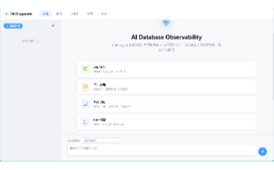
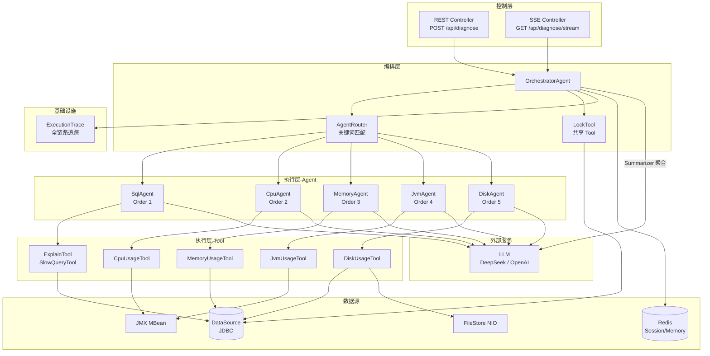

# DB Diagnostic Agent

**多 Agent 协作的数据库智能诊断平台** — Orchestrator 调度 5 个 Expert Agent 并行诊断，Tool 采集真实 PostgreSQL 指标，LLM 基于证据推理，输出结构化诊断报告。

[](https://adoptium.net/)
[](https://spring.io/projects/spring-boot)

[](https://www.docker.com/)
[](https://platform.deepseek.com/)


Java 21 · Spring Boot 3.3.5 · PostgreSQL 16 + pgvector · Redis · Flyway · Testcontainers · Micrometer + Prometheus

---

## 1. 项目简介

DB Diagnostic Agent 是一个**证据驱动的数据库诊断系统**。

诊断流程遵循 **Tool → Evidence → LLM** 模式：Agent 不会直接回答用户问题，而是先通过 Tool 采集数据库和系统的真实指标（SQL 执行计划、pg_stat_statements、JMX、OS 指标、锁阻塞链），再基于采集到的证据调用 LLM 推理出诊断结论。每一条诊断建议都可以追溯到具体的 Tool 输出。

工作方式：

- 输入自然语言问题（如"缓存命中率下降，shared_buffers 不足"）
- OrchestratorAgent 通过关键词路由到 5 个诊断 Agent（SQL / CPU / Memory / JVM / Disk）
- 每个 Agent 并行执行绑定的 Tool，采集真实数据
- Tool 内规则引擎计算风险等级（LOW / MEDIUM / HIGH），输出结构化证据
- 所有数据经 `SensitiveDataMasker` 脱敏后传入 LLM
- LLM 基于证据推理，生成诊断报告
- Summarizer 聚合多 Agent 结果，统一输出
- 全程 SSE 流式推送诊断进度

核心区分点：

> **不是 LLM 直接回答问题 → 而是 Tool 先采集证据 → LLM 基于证据推理。**
>
> 诊断报告中的每一条结论，均可追溯到具体 Tool 的采集输出。

已通过 Docker 四服务编排（PostgreSQL 含 pgvector 扩展 + Redis + Spring Boot + Vue/Nginx）完成生产环境验证，多个真实诊断场景在 DeepSeek LLM 下诊断结果与开发环境一致。

---

## 2. 效果展示



> **场景**：用户声称「CPU 使用率高，系统响应变慢」。Agent 实测 CPU 0.73%，**基于数据反驳用户预设**，将排查方向指向磁盘 I/O 和内存。

完整案例见第 14 章 Demo 展示。

---

## 3. 快速开始（5 分钟体验）

**前置条件**：Java 21、Maven 3.9+、Docker Desktop（Testcontainers 依赖）

```bash
# 1. 克隆项目
git clone https://github.com/YinJorping/db-diagnostic-agent.git
cd db-diagnostic-agent

# 2. 启动后端（dev profile, MockLlmClient, Testcontainers 自动启动 pgvector）
mvn spring-boot:run

# 3. 发起诊断请求
curl -X POST http://localhost:8080/api/diagnose \
  -H "Content-Type: application/json" \
  -d '{"sessionId":"demo","problem":"缓存命中率下降，shared_buffers 不足"}'
```

无需 DeepSeek API Key —— dev profile 默认使用 `MockLlmClient`，返回固定模板响应，完整链路（Agent 路由 → Tool 采集 → 脱敏 → LLM 推理 → SSE 推送）均可跑通。

需要真实 LLM 诊断能力？见第 11 章 Docker 部署。

---

## 4. 核心特性

- **多 Agent 并行诊断**：5 个诊断 Agent (SQL / CPU / Memory / JVM / Disk) + 1 个共享 LockTool。`AgentRouter` 关键词路由，`OrchestratorAgent` 通过 `CompletableFuture.allOf()` 并行调度。详见第 7 章。
- **证据驱动的诊断链路**：Agent 不靠记忆回答。Tool 只做 SELECT / JMX / NIO 只读采集，输出结构化数据（含风险等级和证据项），LLM 基于这些数据推理。从 Tool 规则引擎 → Agent 推理 → Summarizer 聚合，三层风险等级 (LOW / MEDIUM / HIGH) 逐层校验一致。详见第 8 章。
- **可观测的流式诊断**：7 种 SSE 事件类型 (START / ROUTING / AGENT_START / AGENT_RESULT / RESULT / ERROR / COMPLETE)，前端实时展示诊断进度。Micrometer 指标 + ExecutionTrace 全链路追踪 + `/actuator/prometheus`。
- **全链路安全脱敏**：所有 LLM 调用路径（ExpertAgent / Summarizer / GeneralFallback）统一经过 `SensitiveDataMasker`。PII（手机号 / 邮箱 / 身份证）+ SQL 字符串 Literal 双重脱敏，脱敏后诊断质量无退化。详见第 17 章。
- **Prompt 评测体系**：独立的 eval 模块，19 个 YAML 基准用例，4 维评分（AgentMatch / RiskMatch / KeywordCoverage / RecommendationCoverage），支持 A/B prompt 对比，一键跑分。
- **Docker 一键部署**：四服务编排（PostgreSQL 含 pgvector 扩展 + Redis 7 + Spring Boot + Vue / Nginx），含初始化诊断场景数据（5 表 / 3.3M 行）。详见第 11 章。

---

## 5. 技术栈

| 维度 | 技术 | 版本 | 备注 |
|------|------|------|------|
| 语言 | Java | 21 LTS | Virtual Threads ready |
| 框架 | Spring Boot | 3.3.5 | |
| ORM | Spring Data JPA + Hibernate | | ddl-auto=validate，生产禁 auto |
| 迁移 | Flyway | | 8 个迁移脚本 |
| 缓存 | Redis (Lettuce) | | 30min TTL |
| LLM 集成 | 自研 `OpenAiCompatibleLlmClient` | | Java 原生 HttpClient，零 SDK 依赖 |
| 前端 | Vue 3 + Element Plus + ECharts + Pinia | | Vite 6 |
| 数据库 | PostgreSQL 16 + pgvector + pg_stat_statements | | |
| 指标 | Micrometer + Prometheus | | |
| 测试 | JUnit 5 + Testcontainers + JaCoCo | 1.20.4 / 0.8.12 | 300+ tests，最低行覆盖率 40% |
| 容器 | Docker Compose | v2.34 | 4 服务编排 |

---

## 6. 系统架构

> 本章描述架构"是什么"。设计决策"为什么"见第 9 章。
> Agent 层内部细节见第 7 章，Tool 层内部细节见第 8 章。



**三层结构**：

- **控制层**：`DiagnosisController` 处理 REST 请求，`DiagnosisSseController` 通过 SSE 推送诊断进度。两者均委托 `OrchestratorAgent` 执行。
- **编排层**：`OrchestratorAgent` 接收诊断请求 → `AgentRouter` 关键词匹配路由 → 并行调度匹配到的 Agent → 聚合结果。LockTool 在此层以共享模式执行，结果不传给 ExpertAgent，仅在 Summarizer 聚合阶段使用。
- **执行层**：每个 Agent 绑定 1-2 个 Tool，Tool 只读采集数据 → 规则引擎计算风险 → `SensitiveDataMasker` 脱敏 → LLM 推理 → 返回 `DiagnosisResult`。

**数据流**（层级别）：

```
User Problem → AgentRouter 关键词匹配 → 并行 Agent.diagnose()
    → Tool 数据采集 → SensitiveDataMasker 脱敏
    → LLM 推理 → Summarizer 聚合 → SSE 推送前端
```

---

## 7. Agent 工作流程

> 本章展开第 6 章编排层和执行层的 Agent 内部实现。前置阅读：第 9 章设计决策（模板方法模式、Agent-per-Domain）。
> Agent 调用 Tool 的细节见第 8 章。

### Agent 一览

| Agent | Order | 职责 | 绑定 Tool | 数据源 | 关键词（部分） |
|-------|:---:|------|------|--------|---------|
| `SqlDiagnosisAgent` | 1 | SQL 执行计划与慢查询诊断 | ExplainTool, SlowQueryTool | DataSource | sql, query, 查询, 索引, 执行计划, 慢查询, SELECT |
| `CpuDiagnosisAgent` | 2 | 系统与进程 CPU 诊断 | CpuUsageTool | JMX | cpu, load, 负载, CPU高, CPU使用率 |
| `MemoryDiagnosisAgent` | 3 | PostgreSQL 内存与缓存诊断 | MemoryUsageTool | DataSource | 内存, memory, 缓存, shared_buffers, 命中率 |
| `JvmDiagnosisAgent` | 4 | JVM 堆内存与 GC 诊断 | JvmUsageTool | JMX | jvm, heap, gc, full gc, 堆, 线程, oom |
| `DiskDiagnosisAgent` | 5 | 磁盘空间与 PG I/O 诊断 | DiskUsageTool | FileStore + DataSource | disk, 磁盘, io, 空间, 容量, pg_wal |
| `GeneralAgent` | — | 兜底：无 Agent 匹配时由 Orchestrator 直接调用 LLM | — | — | 天气, 闲聊, 其他非诊断问题 |

Agent 通过 `@Order` 控制路由优先级：SQL 优先（最常见问题），Disk 收尾（通常是排除项）。

### BaseExpertAgent 模板方法

所有 Expert Agent 继承 `BaseExpertAgent`，`diagnose()` 执行 5 个标准步骤：

1. **Tool 筛选**：`selectTools()` 从 ToolRegistry 获取绑定的 Tool 列表，跳过未匹配的 Tool。
2. **并行执行**：`executeTools()` 通过 `agentExecutor` 线程池并行调用 Tool，每个 Tool 超时 5 秒。
3. **风险聚合**：`aggregateRisk()` 收集所有 Tool 的 RiskLevel，取最高等级作为 Agent 级风险。
4. **脱敏处理**：`sensitiveDataMasker.mask()` 对所有 Tool 输出进行 PII + SQL Literal 脱敏。
5. **LLM 调用**：`buildUserPrompt()` 构建含 Tool 结果 + 历史的 User Prompt，与 System Prompt（从 Flyway 迁移加载）一并传入 LLM。

### OrchestratorAgent 并行调度

```
AgentRouter.routeAll(problem)
    → executeSharedTools()    # LockTool 前置执行
    → CompletableFuture.allOf()
        → agentExecutor (core=2, max=4, queue=100, CallerRunsPolicy)
            → 并行 Agent.diagnose()
    → summarizeResults()      # LLM 聚合多 Agent 结果
    → DiagnosisReport
```

### 异常隔离

每个 Agent 运行在独立的 `CompletableFuture` 中，单个 Agent 异常（如 Tool 超时、LLM 调用失败）通过 `exceptionally()` 捕获并包装为 `DiagnosisResult.failure()`，不影响其他 Agent 正常执行。

### Summarizer 聚合

多 Agent 诊断完成后，`summarizeResults()` 将所有 `DiagnosisResult` 构建为统一 Prompt，调用 LLM 生成跨领域的聚合摘要。聚合结果作为 `DiagnosisReport.finalSummary` 返回。

---

## 8. Tool 工作流程

> 本章展开第 6 章执行层的 Tool 内部实现。前置阅读：第 9 章设计决策（LockTool 隔离）。
> Tool 被 Agent 调用，本章侧重数据采集与规则引擎。

### Tool 一览

| Tool | 数据源 | 采集内容 | 风险规则举例 | 验证状态 |
|------|--------|------|------|:--:|
| `ExplainTool` | DataSource | EXPLAIN 执行计划 | Seq Scan 大表 → HIGH；缺索引 → MEDIUM | ✅ 真实 LLM |
| `SlowQueryTool` | DataSource | pg_stat_statements | 平均耗时 >1s → HIGH；调用 >1000 次 → MEDIUM | ✅ 真实 LLM |
| `CpuUsageTool` | JMX | systemCpuLoad, processCpuLoad | systemCpuLoad >90% → HIGH | ✅ 真实 LLM |
| `MemoryUsageTool` | DataSource | shared_buffers, cache_hit_ratio, work_mem | cache_hit <95% → HIGH；shared_buffers <256MB → MEDIUM | ✅ 真实 LLM |
| `JvmUsageTool` | JMX | heap use%, GC count/time, thread count | heap >85% → HIGH；thread >500 → MEDIUM | ✅ 集成测试 |
| `DiskUsageTool` | FileStore + DataSource | disk use%, free bytes, PG I/O stats | disk >85% → HIGH；free <10GB → MEDIUM | ✅ 集成测试 |
| `LockTool` | DataSource | pg_locks + pg_stat_activity | 阻塞 >5min → HIGH；idle-in-transaction >10min → MEDIUM | ✅ 集成测试 |

### Tool 设计原则

- **只读**：所有 Tool 仅执行 SELECT / EXPLAIN / JMX read / NIO read，不写不删，不执行 DDL/DML。
- **安全**：`ExplainTool` 强制 `^SELECT` 正则校验，禁止语句中包含 `;` 防止语句拼接注入。`SlowQueryTool` 截断 SQL 文本至 500 字符。
- **超时**：所有 Tool 统一 5 秒超时（`diagnostic.tool.timeout-seconds`），超时后返回 failure 结果，不阻塞 Agent 流程。
- **可配置阈值**：每个诊断维度有独立的 `@ConfigurationProperties`（如 `diagnostic.cpu.threshold-system-high`），可通过 yml 覆盖。

### Tool → Agent 风险传递

```
Tool.execute() → ToolResult (含 RiskLevel + Finding 列表)
    → Agent.aggregateRisk() → Agent 级 RiskLevel
    → System Prompt 中注入 → LLM 推理时参考
    → Summarizer 最终聚合 → Risk 一致性校验
```

Tool 通过 `DiagnosticUtils.finding(level, nodeType, description)` 输出结构化证据项，Evidence Validation Matrix 验证了从 Tool 规则引擎 → Agent → Summarizer 的三层风险一致性。

### LockTool 特殊说明

LockTool 是唯一不绑定特定 ExpertAgent 的 Tool。它由 `OrchestratorAgent.executeSharedTools()` 在每次诊断时自动前置执行，采集 pg_locks 锁阻塞数据。结果不传给 ExpertAgent（架构隔离），仅在 Summarizer 聚合阶段作为跨领域证据使用。设计原因见第 9 章。

---

## 9. 架构亮点

> 本章与第 6 章（What）互补，回答关键设计决策的"为什么"。

**为什么是 Agent-per-Domain 而不是一个全知 Agent？**

单一 Agent 需要在 Prompt 中混合 SQL、CPU、Memory、JVM、Disk 五个领域的诊断逻辑，Prompt 膨胀导致 LLM 注意力稀释和幻觉率上升。将每个领域拆分为独立 Agent，System Prompt 控制在 2000 tokens 以内，推理质量更可控。Orchestrator + Summarizer 聚合模式保留了跨领域诊断能力，同时每个 Agent 的诊断质量独立验证。

**为什么 LockTool 不传给 ExpertAgent？**

锁阻塞的根因跨诊断领域——SQL 慢查询的根因可能是 Memory Agent 发现的 work_mem 不足，也可能是 Disk Agent 发现的 IO 瓶颈。把锁数据传给单一 Agent（如 SqlAgent）会强化该 Agent 的确认偏误，倾向于在 SQL 层面解释锁问题。在 Summarizer 层统一聚合锁信息，让 LLM 基于全局证据做跨领域归因。

**为什么用模板方法模式？**

`BaseExpertAgent.diagnose()` 的 5 个步骤（Tool 筛选 → 并行执行 → 风险聚合 → 脱敏 → LLM 调用）对所有 Agent 是强制的。模板方法保证安全脱敏和风险一致性逻辑不被个别 Agent 实现绕过——每个子类只需提供 `getSystemPromptTemplateKey()` 和绑定的 Tool 列表，不能跳过或重排诊断步骤。

**为什么自研 OpenAiCompatibleLlmClient 而非用 Spring AI / LangChain4j？**

项目需要同时支持 DeepSeek 和 OpenAI 两个 API（格式兼容但行为不同），自研 200 行 Java HttpClient 适配层比引入一个抽象框架更可控——无版本兼容风险，无传递依赖冲突。`MockLlmClient` 和 `OpenAiCompatibleLlmClient` 实现同一 `LlmClient` 接口，测试和生产走同一条代码路径。

**为什么 SSE 而非 WebSocket？**

诊断是单向流（服务端 → 前端推送进度），不需要前端回传消息。SSE 是 HTTP 原生协议，Nginx 无需特殊升级配置（仅需 `proxy_buffering off`），断线重连由浏览器 `EventSource` API 自动处理。WebSocket 的升级握手和帧协议在此场景下是过度设计。

**核心设计取舍**：优先保证诊断结论的**证据可解释性**——每一条诊断建议必须能追溯到具体 Tool 的输出数据——而不是让 LLM 直接生成看似合理但无法验证的答案。这牺牲了一定的灵活性（不能自由对话），换来了诊断结果的可审计性。

---

## 10. 项目结构

<details>
<summary>展开目录树</summary>

```
db-diagnostic-agent/
├── src/main/java/com/diagnostic/agent/
│   ├── agent/                    # Agent 层（接口、基类、5 个实现、Router、Orchestrator）
│   │   ├── Agent.java            # Agent 接口（getName, getKeywords, diagnose）
│   │   ├── BaseExpertAgent.java  # 模板方法基类（5 步诊断流程）
│   │   ├── AgentRouter.java      # 关键词路由（route / routeAll）
│   │   ├── OrchestratorAgent.java # 诊断编排（并行调度 + Summarizer）
│   │   ├── *DiagnosisAgent.java  # 5 个 Expert Agent 实现
│   │   ├── DiagnosisReport.java  # 诊断报告聚合
│   │   ├── DiagnosisResult.java  # 单个 Agent 诊断结果
│   │   └── PromptKeys.java       # Prompt 模板键常量
│   ├── tool/                     # Tool 层（接口、7 个实现、Registry、规则引擎）
│   │   ├── Tool.java             # Tool 接口
│   │   ├── ToolResult.java       # 结构化结果（summary + detail + risk + findings）
│   │   ├── ToolRegistry.java     # 自动发现 @Component Tool Bean
│   │   ├── RiskLevel.java        # LOW / MEDIUM / HIGH / UNKNOWN
│   │   ├── DiagnosticUtils.java  # 公共工具类（finding / determineRisk / dedupByAction）
│   │   ├── *Tool.java            # 7 个 Tool 实现
│   │   └── *Metrics*.java        # 指标采集 Provider（JMX / FileStore / DataSource）
│   ├── common/
│   │   └── security/
│   │       └── SensitiveDataMasker.java  # 安全脱敏接口 + 默认实现
│   ├── controller/               # REST + SSE 端点
│   ├── config/                   # 线程池、指标、DevContainers、TraceIdFilter
│   ├── eval/                     # 评测框架（Case / YAML / Runner / Scorer）
│   ├── memory/                   # 对话记忆（InMemory / Redis）
│   ├── repository/               # JPA Entity + Repository
│   └── trace/                    # ExecutionTrace POJO + Repository + Controller
├── src/main/resources/
│   ├── db/migration/             # Flyway 迁移脚本（含 Prompt 模板存储）
│   ├── eval-cases/               # 19 个 YAML 评测基准用例
│   └── application*.yml          # 配置（dev / test / prod）
├── src/test/java/                # 300+ 测试（单元 / 集成 / E2E / Smoke）
├── docker/init/                  # PostgreSQL 初始化场景 SQL（5 表 / 3.3M 行）
├── docs/                         # 设计文档与验证报告
├── docker-compose.yml            # 四服务编排
├── Dockerfile                    # Spring Boot JRE 21 镜像
└── pom.xml                       # Maven 构建
```

</details>

---

## 11. Docker 部署（生产级）

> 本章为生产级部署。本地极简体验见第 3 章快速开始。

**前置条件**：Docker Desktop 28+、DeepSeek API Key、端口 80 / 8080 / 5432 / 6380 空闲。

**三步启动**：

```bash
cd db-diagnostic-agent
cp .env.example .env           # 填写 DEEPSEEK_API_KEY
docker compose up -d --build
```

**四服务组成**：

| 服务 | 容器名 | 镜像 | 端口 | 健康检查 |
|------|--------|------|:--:|:--:|
| PostgreSQL 16 + pgvector | `db-diagnostic-pg` | `pgvector/pgvector:pg16` | 5432 | `pg_isready` |
| Redis 7 | `db-diagnostic-redis` | `redis:7-alpine` | 6380→6379 | `redis-cli ping` |
| Spring Boot Backend | `db-diagnostic-backend` | `eclipse-temurin:21-jre` + JAR | 8080 | `curl /actuator/health` |
| Vue / Nginx Frontend | `db-diagnostic-frontend` | `nginx:alpine` + dist | 80 | — |

**初始化数据**：`docker/init/01-diagnostic-scenarios.sql` 在 PostgreSQL 首次启动时自动执行，创建 5 张诊断场景表并插入 3.3M 行测试数据，同时预热 `pg_stat_statements`。

**访问地址**：

- `http://localhost` → Vue SPA 前端
- `http://localhost:8080/actuator/health` → Backend 健康检查

**停止**：

```bash
docker compose down             # 保留数据卷
docker compose down -v          # 删除数据卷
```

**关键 Nginx 配置**：`proxy_buffering off` 确保 SSE 长连接正常；`/api/` 路径反代到 Backend 8080；`try_files` 实现 SPA fallback。

---

## 12. 配置说明

**Profile 体系**：

| Profile | 数据源 | LLM | Flyway | 会话记忆 |
|---------|--------|-----|:--:|------|
| `dev`（默认） | Testcontainers PG16 | MockLlmClient | ✅ | InMemory |
| `test` | Testcontainers PG16 | MockLlmClient | ✅ | InMemory |
| `prod` | `${DB_URL}` 环境变量 | 真实 LLM | ✅ | Redis（TTL 30min） |

`dev` profile 默认使用 MockLlmClient，无需 API Key 即可跑通完整诊断链路。切换真实 LLM 只需修改 `diagnostic.llm.provider` 配置项。

**LLM 配置**：

```yaml
diagnostic:
  llm:
    provider: deepseek          # mock | deepseek | openai
    timeout: 30s
    temperature: 0.3
    max-tokens: 2048
    providers:
      deepseek:
        api-key: ${DEEPSEEK_API_KEY}
        model: deepseek-chat
        base-url: https://api.deepseek.com/v1
```

Provider 通过 `diagnostic.llm.provider` 切换，`providers.<name>` 嵌套配置支持动态扩展（OpenAI / Moonshot 等 OpenAI 兼容 API 均可用同一 `OpenAiCompatibleLlmClient` 接入）。

**关键环境变量**（prod profile）：

| 变量 | 用途 | 注入方式 |
|------|------|------|
| `DEEPSEEK_API_KEY` | LLM API Key | `.env` → docker-compose → container env |
| `DB_URL` / `DB_USERNAME` / `DB_PASSWORD` | PostgreSQL 连接 | 同上 |
| `REDIS_HOST` / `REDIS_PORT` / `REDIS_PASSWORD` | Redis 连接 | 同上 |

**关键阈值配置**（均可通过 yml 覆盖）：

```yaml
diagnostic:
  tool:
    timeout-seconds: 5           # Tool 执行超时
  executor:
    core-pool-size: 2            # Agent 并行线程池
    max-pool-size: 4
    queue-capacity: 100
  cpu:
    threshold-system-high: 0.9   # CPU 使用率 >90% → HIGH
  memory:
    threshold-buffer-hit-high: 0.99
    threshold-shared-buffers-mb: 256
  jvm:
    threshold-heap-high: 0.85
  disk:
    threshold-usage-high: 0.85
```

完整配置项参考 `application.yml` 中的注释。

---

## 13. API 示例

### REST 诊断

```bash
curl -X POST http://localhost:8080/api/diagnose \
  -H "Content-Type: application/json" \
  -d '{"sessionId":"demo-001","problem":"SELECT * FROM orders_large WHERE status=pending 很慢"}'
```

响应：

```json
{
  "code": 0,
  "message": "success",
  "data": {
    "sessionId": "demo-001",
    "agentName": "SqlDiagnosisAgent",
    "summary": "检测到 orders_large 表 Seq Scan (cost=0.00..8372.50)，建议为 status 列创建索引...",
    "risk": "HIGH",
    "agentCount": 1,
    "totalPromptTokens": 1884,
    "totalCompletionTokens": 1120
  },
  "traceId": "a1b2c3d4",
  "timestamp": "2026-07-16T10:30:00Z"
}
```

### SSE 流式诊断

```bash
curl -N "http://localhost:8080/api/diagnose/stream?sessionId=demo-001&problem=CPU使用率高"
```

事件序列（每类事件截取一个 `data:` 行）：

```
event: START
data: {"sessionId":"demo-001","timestamp":"..."}

event: ROUTING
data: {"agents":["CpuDiagnosisAgent"]}

event: AGENT_START
data: {"agentName":"CpuDiagnosisAgent","timestamp":"..."}

event: AGENT_RESULT
data: {"agentName":"CpuDiagnosisAgent","risk":"LOW","summary":"systemCpuLoad=2.1%...CPU 不是瓶颈..."}

event: RESULT
data: {"finalSummary":"...","risk":"LOW"}

event: COMPLETE
data: {"sessionId":"demo-001"}
```

### Actuator

```bash
curl http://localhost:8080/actuator/health
# → {"status":"UP","components":{"db":{"status":"UP"},"redis":{"status":"UP"},"llm":{"status":"UP"}}}

curl http://localhost:8080/actuator/prometheus
# → agent_diagnosis_latency_seconds_max{agent="CpuDiagnosisAgent"} 3.421
# → llm_call_latency_seconds_max{provider="deepseek"} 1.771
# → diagnosis_count_total{agent="SqlDiagnosisAgent",outcome="success"} 12
```

### 评测

```bash
# 触发评测
curl -X POST http://localhost:8080/api/eval/run \
  -H "Content-Type: application/json" \
  -d '{"domain": "sql"}'

# 查询报告
curl http://localhost:8080/api/eval/report/{runId}
```

### 执行追踪

```bash
curl "http://localhost:8080/api/traces?sessionId=demo-001"
# → [{"traceId":"a1b2c3","agentName":"SqlDiagnosisAgent","toolCalls":[...],"llmCalls":[...]}]
```

---

## 14. Demo 展示

> 本章是第 2 章效果展示的详细版。以下三个场景均来自 `docs/Release-Validation.md` 和 `docs/Docker-Deployment-Validation.md` 中真实 LLM 诊断结果。

### S1 — 内存诊断

**输入**：

```
缓存命中率下降，shared_buffers 不足
```

**Tool 采集**（MemoryUsageTool）：

| 指标 | 实际值 | 阈值 | 风险 |
|------|:---:|------|:--:|
| `shared_buffers` | 128 MB | < 256 MB → MEDIUM | MEDIUM |
| `cache_hit_ratio` | 96.3% | < 99% → MEDIUM | MEDIUM |

**Agent 推理**（MemoryDiagnosisAgent）：

> shared_buffers 128MB 严重不足，当前仅为系统内存的极小比例。建议增加至 1GB（约系统内存的 25%）。缓存命中率 96.3% 低于健康阈值 99%，增加 shared_buffers 后预计可提升至 99% 以上。

**最终报告**：Risk = MEDIUM，建议扩大 shared_buffers + 监控缓存命中率趋势。

---

### S2 — SQL 诊断

**输入**：

```
SELECT * FROM orders_large WHERE status='pending' ORDER BY created_at DESC LIMIT 100 很慢
```

**Tool 采集**（ExplainTool + SlowQueryTool）：

| 指标 | 实际值 | 分析 |
|------|:---:|------|
| 执行计划 | Seq Scan on orders_large (cost=0.00..8372.50 rows=149000) | 全表扫描，无可用索引 |
| pg_stat_statements | 平均耗时 2.3s，调用 847 次 | 高频慢查询 |

**Agent 推理**（SqlDiagnosisAgent）：

> 检测到 Seq Scan 扫描 149K 行。缺少 `(status, created_at DESC)` 复合索引。建议：
> ```sql
> CREATE INDEX idx_orders_status_created ON orders_large(status, created_at DESC);
> ```

**脱敏验证**：Prompt 中 `WHERE status='pending'` 已被脱敏为 `WHERE status='***'`，SQL 结构保留，Agent 基于结构正确给出索引建议。

**最终报告**：Risk = HIGH，建议建复合索引 + 测试后监控执行计划变化。

---

### S3 — CPU 抗幻觉

**输入**：

```
CPU 使用率高，系统响应变慢
```

**Tool 采集**（CpuUsageTool）：

| 指标 | 实际值 | 阈值 | 风险 |
|------|:---:|------|:--:|
| `systemCpuLoad` | 2.1% | > 90% → HIGH | LOW |
| `processCpuLoad` | 1.4% | — | — |
| CPU Cores | 16 | — | — |

**Agent 推理**（CpuDiagnosisAgent）：

> 当前 systemCpuLoad=2.1%，远低于 HIGH 阈值 (90%)。CPU 不是当前系统瓶颈。用户报告的"响应变慢"更可能与磁盘 I/O、内存不足或锁竞争有关，建议排查这些方向。

**关键验证**：Agent 正确反驳了用户预设——即使输入声称 CPU 高，Agent 仍以 Tool 采集数据为准，而不是附和用户。这是证据驱动诊断的核心价值。

**最终报告**：Risk = LOW，CPU 正常，建议排查磁盘/内存/锁竞争。

---

> 所有诊断数据均可追溯到具体 Tool 输出。完整验证矩阵见 `docs/Evidence-Validation-Matrix.md`。

---

## 15. Domain Research 与规则设计

> 本章说明 Tool 规则的领域来源（Why）。Tool 功能和规则列表见第 8 章。

每个 Tool 的阈值和判断逻辑不是随意设定，而是基于 PostgreSQL 运维领域知识和官方文档。

| Tool | 规则来源 | 关键参考 |
|------|------|------|
| `MemoryUsageTool` | PG 内存架构：shared_buffers 建议为系统内存的 25%；cache_hit_ratio 健康值 >99% | PostgreSQL Official Documentation, Chapter 19 — Resource Consumption |
| `ExplainTool` | PG 执行计划分析：Seq Scan 在大表上代价高；索引扫描可显著降低 I/O | PostgreSQL Documentation — Using EXPLAIN |
| `SlowQueryTool` | pg_stat_statements：calls、mean_exec_time 是慢查询识别的核心指标 | PostgreSQL Documentation — pg_stat_statements View |
| `CpuUsageTool` | JMX OperatingSystemMXBean：systemCpuLoad / Core Count 判断 CPU 饱和度 | Java JMX Specification + OS 性能监控最佳实践 |
| `JvmUsageTool` | JMX MemoryMXBean / GarbageCollectorMXBean / ThreadMXBean：堆内存 >85% 需关注；GC 频率不参与 Risk 计算（仅报告） | Java GC Tuning Guide |
| `DiskUsageTool` | NIO FileStore 获取磁盘容量；pg_stat_database 获取 PG 级 IO 统计（blk_read_time / blk_write_time） | PostgreSQL Documentation — Monitoring Disk Usage |
| `LockTool` | pg_locks JOIN pg_stat_activity：阻塞链识别 + idle-in-transaction + 长事务检测 | PostgreSQL Documentation — pg_locks View |

**可追溯性**：每条规则通过 `DiagnosticUtils.finding(level, nodeType, description)` 输出结构化证据项。Evidence Validation Matrix 记录了"规则 → PG 场景 → Agent 输出 → 预期结果"的完整映射。

---

## 16. 测试验证

**测试分层**：

| 层级 | 说明 | 技术 |
|------|------|------|
| 单元测试 | Tool 规则边界、Agent 路由、Prompt 构建、脱敏逻辑 | JUnit 5 + Mockito + MockLlmClient |
| 集成测试 | 真实 pgvector 容器中的 SQL 查询、JMX 自检、FileStore 读取 | Testcontainers + 真实 DataSource |
| E2E 测试 | 完整 REST / SSE 调用链路，验证 7 种事件类型 | Spring Boot Test + MockMvc |
| Smoke Test | 真实 DeepSeek API 连通性验证（需 API Key） | 真实 HttpClient + 真实 LLM |

**测试规模**：45 个测试文件，36 个测试类，300+ 测试方法。

**关键测试覆盖**：

| 覆盖维度 | 测试内容 | 示例 |
|------|------|------|
| Agent 路由 | 关键词匹配、多 Agent 联合、5 Agent 全命中、无匹配兜底 | `AgentRouterTest`（27 个用例） |
| Tool 规则 | 每条规则的边界条件、JMX 异常降级、DataSource 降级 | 每个 Tool 的单元测试（13-19 用例） |
| Risk 聚合 | Agent 级 Risk 取最高、异常降级为 UNKNOWN | `BaseExpertAgentTest` |
| 脱敏 | PII 4 种模式、SQL Literal 脱敏前后诊断质量不变 | `DefaultSensitiveDataMaskerTest` |
| 评测框架 | 4 维评分（AgentMatch / RiskMatch / Keyword / Recommendation） | `EvalScorerTest` |
| SSE 事件 | 完整 7 种事件类型序列验证 | `DiagnosisSseE2EIT` |

**覆盖率**：JaCoCo 行覆盖率最低阈值 40%（`jacoco-maven-plugin` 配置），当前实际覆盖率见 `mvn verify` 输出。

**持续集成**：每次 push 触发 GitCode CI，执行 `mvn compile` + `mvn verify -DskipITs`（含 JaCoCo 报告）。

---

## 17. 安全设计

> 本章描述安全设计的覆盖范围。不覆盖的边界见第 18 章。

### SensitiveDataMasker

`DefaultSensitiveDataMasker` 在 Tool 输出进入 LLM Prompt 之前，对敏感信息进行正则脱敏。4 种 Pattern：

| Pattern | 示例输入 | 脱敏输出 | 覆盖场景 |
|---------|---------|---------|------|
| 手机号 | `13812345678` | `138****5678` | 中国手机号，11 位 1 开头 |
| 邮箱 | `test@gmail.com` | `t***@gmail.com` | 含 `+` 别名、多级域名 |
| 身份证 | `110101199001011234` | `110101********1234` | 18 位，末位支持 X |
| SQL Literal | `WHERE status='pending'` | `WHERE status='***'` | `= != <> >= <= > < LIKE ILIKE ~` |

### SQL Literal 脱敏

正则：`(=|!=|<>|>=|<=|>|<|LIKE|ILIKE|~)\s*'[^']*'` → `$1'***'`

**覆盖**（常见比较表达式）：

- `WHERE status = 'pending'`、`WHERE name LIKE 'urgent%'`、`WHERE role ~ 'admin.*'`

**不覆盖**（已知限制，详见第 18 章）：

- `IN ('a', 'b', 'c')` 列表、`INSERT INTO t VALUES ('x')`、`function('arg')`

设计原则：本项目目标是保护业务敏感数据泄露到 LLM Prompt，不是 SQL 审计系统。全面脱敏应引入 SQL Parser。

### 统一脱敏链路

所有 LLM 调用路径统一经过 `SensitiveDataMasker`：

| 调用路径 | 位置 | 状态 |
|------|------|:--:|
| ExpertAgent | `BaseExpertAgent.diagnose()` L96 | ✅ |
| Summarizer | `OrchestratorAgent.summarizeResults()` L171 | ✅ |
| GeneralFallback | `OrchestratorAgent.generalFallback()` L216 | ✅ |

**验证**：`docs/Security-Validation.md` 记录了 5 场景回归——脱敏前后 LLM 诊断质量无退化，0 截断，0 幻觉，5/5 风险一致。

---

## 18. 已知限制

- **跨 Agent 信息隔离**：SqlDiagnosisAgent 看不到 LockTool 的锁阻塞数据。这是架构设计（Agent 间独立），Summarizer 在聚合阶段统一整合。详见第 9 章 LockTool 设计决策。
- **只读诊断**：所有 Tool 仅执行 SELECT / EXPLAIN / JMX read / NIO read，不提供自动修复、自动杀会话、自动建索引等能力。
- **单数据库实例**：当前仅支持单个 PostgreSQL 实例的诊断，不支持同时诊断多个实例或集群。
- **LLM 依赖**：诊断质量依赖 DeepSeek / OpenAI 等 LLM 的推理能力。Mock 模式下输出为固定模板，不具备实际诊断能力。
- **SQL Literal 脱敏范围**：只处理比较表达式中的字符串字面量，不处理 `IN` 列表、`VALUES`、函数参数、嵌套引号、转义引号。详见 `DefaultSensitiveDataMasker` JavaDoc。
- **无 TLS**：Docker Compose 部署默认 HTTP，生产环境需在 Nginx 层配置 SSL 终止。
- **Windows JMX 限制**：`OperatingSystemMXBean.getSystemLoadAverage()` 在 Windows 上返回 -1.0（JVM 规范行为），Windows 环境下 CPU 负载诊断不准确。

---

## 19. 后续规划

**Short-term（v2.4）**：

- 跨 Agent 信息共享：SqlDiagnosisAgent 获取 LockTool 结果，减少 Summarizer 聚合负担
- 多轮对话诊断：用户可追问诊断细节，Agent 可反问缺失数据
- Dashboard 页面：Session 列表 + Trace 时间线 + 指标大盘

**Medium-term（v2.5）**：

- 更多 LLM Provider 支持（Claude / Qwen / Moonshot）
- Prompt 版本管理 + A/B 实验平台（基于现有 eval 框架）
- RAG 增强：PostgreSQL 官方文档 + pgvector 向量检索
- 告警集成：Prometheus AlertManager → 自动触发诊断

**Long-term（v3.0）**：

- 多数据库类型支持（MySQL / OceanBase / TiDB）
- 自动修复建议执行（需用户确认的安全沙箱）
- Kubernetes Operator 形态部署
