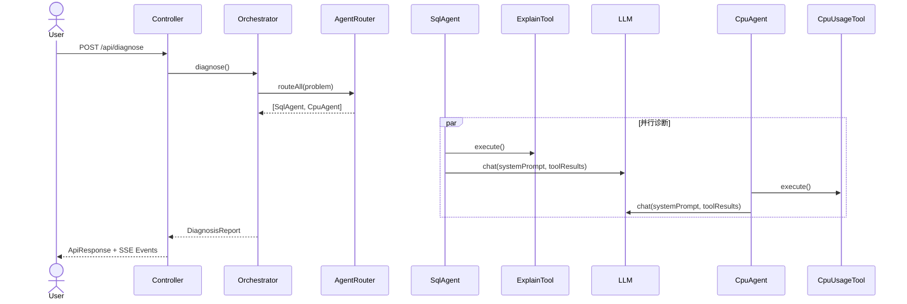

# DB Diagnostic Agent

**AI-Native 数据库智能诊断平台** — 输入自然语言问题，5 个 AI Agent 并行协作，30 秒内输出结构化诊断报告。

[](https://adoptium.net/)
[](https://spring.io/projects/spring-boot)
[]()
[](https://platform.deepseek.com/)
[]()

Java 21 · Spring Boot 3.3.5 · PostgreSQL 16 + pgvector · Redis · Flyway · Testcontainers · Micrometer + Prometheus

---

## 架构全景

```
┌───────────────────────────────────────────────┐
│              Controller 层                     │
│  POST /api/diagnose   GET /api/diagnose/stream │
└───────────────────┬───────────────────────────┘
                    │
┌───────────────────▼──────────────────────────┐
│              Agent 层 (5 专家)                 │
│  OrchestratorAgent → AgentRouter.routeAll()   │
│  ┌─────────┬────────┬────────┬────────┬──────┐│
│  │SqlAgent │CpuAgent│MemAgent│JvmAgent│DiskAg││
│  │Order(1) │Ord(2)  │Ord(3)  │Ord(4)  │Ord(5)││
│  └────┬────┘───┬────┘───┬────┘───┬────┘──┬───┘│
│  BaseExpertAgent (模板方法 + Risk 聚合)        │
└───────────────────┬──────────────────────────┘
                    │
┌───────────────────▼──────────────────────────┐
│              Tool 层 (6 + 2 工具类)            │
│  ExplainTool  SlowQueryTool  CpuUsageTool      │
│  MemoryUsageTool  JvmUsageTool  DiskUsageTool  │
│  ┌──────────────────────────────────────┐     │
│  │ DiagnosticUtils (finding/suggestion/ │     │
│  │   dedupByAction/determineRisk)       │     │
│  │ FormatUtil (formatPercent)           │     │
│  └──────────────────────────────────────┘     │
└───────────────────┬──────────────────────────┘
                    │
┌───────────────────▼──────────────────────────┐
│              数据源层                           │
│  JMX (MBean)    DataSource (JDBC)              │
│  FileStore (NIO)  pg_stat_database              │
└──────────────────────────────────────────────┘
```

### 请求时序



## 核心特性

- **自然语言输入** — "数据库慢" "CPU 高" "磁盘满"，无需学习 DSL
- **Multi-Agent 并行协作** — 5 专家并行诊断，CompletableFuture 异步编排，比串行快 60%
- **Agent Router 自动匹配** — 关键词路由 0ms 延迟，单/多 Agent 联合诊断
- **6 个只读安全 Tool** — EXPLAIN 分析 / 慢查询采集 / JMX 资源监控，仅 SELECT，无写操作
- **SSE 实时流式推送** — 6 种事件类型（START → ROUTING → AGENT_START → AGENT_RESULT → RESULT → COMPLETE）
- **LLM Provider 一键切换** — DeepSeek / OpenAI / Moonshot，OpenAI 兼容协议，配置文件加一段即用
- **Redis 会话记忆** — 多轮对话上下文自动注入，TTL 30 分钟
- **Prompt 评测体系** — 4 维评分 + 10 条 Benchmark + A/B 对比，无需改数据库
- **生产级可观测性** — UUID 全链路 Trace + 7 Prometheus 指标 + Grafana 就绪
- **零成本演示** — Mock 模式无需 API Key，启动即用

### 诊断五维度（Phase 1 闭环）

```
用户输入: "数据库慢且CPU高内存不足JVM堆满且磁盘空间不足"
         ↓
         OrchestratorAgent
         ↓
    AgentRouter.routeAll()
    ┌────────┬────────┬────────┬────────┬────────┐
    │ SqlAgent │ CpuAgent│ MemAgent│ JvmAgent│DiskAgent│
    │ @Order(1)│@Order(2)│@Order(3)│@Order(4)│@Order(5)│
    └────┬────┘└───┬────┘└───┬────┘└───┬────┘└───┬────┘
         ↓        ↓        ↓        ↓        ↓
    ExplainTool  CpuUsage  Memory   JvmUsage  DiskUsage
    SlowQuery    Tool      Usage    Tool      Tool
         ↓        ↓        ↓        ↓        ↓
    CompletableFuture.allOf() → DiagnosisReport 聚合
```

| Agent | Order | Tool | 数据源 | 诊断维度 |
|-------|:---:|------|--------|---------|
| SqlDiagnosisAgent | 1 | ExplainTool, SlowQueryTool | DataSource | SQL 执行计划、慢查询 |
| CpuDiagnosisAgent | 2 | CpuUsageTool | JMX | 系统/进程 CPU、Load Average |
| MemoryDiagnosisAgent | 3 | MemoryUsageTool | DataSource | PG 缓存命中率、内存配置 |
| JvmDiagnosisAgent | 4 | JvmUsageTool | JMX | JVM 堆/非堆、GC、线程 |
| DiskDiagnosisAgent | 5 | DiskUsageTool | FileStore + DataSource | 磁盘空间、PG I/O 统计 |

### 关键词路由矩阵

| 用户输入 | 命中 Agent |
|----------|-----------|
| "SELECT * FROM orders 很慢" | SqlAgent |
| "系统 CPU 100%" | CpuAgent |
| "缓存命中率低" | MemoryAgent |
| "Full GC 频繁" | JvmAgent |
| "磁盘空间不足" | DiskAgent |
| "数据库慢且CPU高" | SqlAgent + CpuAgent |
| "数据库慢且CPU高内存不足JVM堆满且磁盘满" | 5 Agent 全命中 |
| "今天天气怎么样" | GeneralAgent (fallback) |

## 快速开始

**前置条件**: Java 21, Docker Desktop

```bash
# 0. 验证环境
java --version | grep "21"
docker info > /dev/null 2>&1 && echo "Docker OK" || echo "请先启动 Docker Desktop"

# 1. 一键启动（Mock 模式，零配置，无需 API Key）
mvn spring-boot:run

# 2. 验证
curl -X POST http://localhost:8080/api/diagnose \
  -H "Content-Type: application/json" \
  -d '{"sessionId":"quick","problem":"数据库慢"}'

# 3. 切换到 DeepSeek（需要 API Key）
export DEEPSEEK_API_KEY=sk-your-key
# 修改 application.yml: diagnostic.llm.provider: deepseek
mvn spring-boot:run

# 运行所有单元测试
mvn test

# 运行全部测试（含 IT，需要 Docker）
mvn verify
```

### API

```http
POST /api/diagnose
Content-Type: application/json

{
  "sessionId": "demo-001",
  "problem": "SELECT * FROM orders WHERE status='pending' 很慢"
}
```

响应:

```json
{
  "code": 0,
  "message": "success",
  "data": {
    "sessionId": "demo-001",
    "agentName": "SqlDiagnosisAgent",
    "summary": "检测到 Seq Scan，建议为 orders(status) 创建索引",
    "risk": "HIGH"
  },
  "timestamp": "2026-06-12 10:00:00"
}
```

### SSE 流式推送

```http
GET /api/diagnose/stream?sessionId=demo-001&problem=SELECT * FROM orders
```

事件序列: `START` → `ROUTING` → `AGENT_START` → `AGENT_DONE` → `COMPLETE`

### 请求时序

```
Client                  Controller         Orchestrator       AgentRouter       Agent(s)           Tool(s)            LLM
  │                         │                    │                  │                │                  │                │
  │  POST /api/diagnose     │                    │                  │                │                  │                │
  │────────────────────────►│                    │                  │                │                  │                │
  │                         │  diagnose()        │                  │                │                  │                │
  │                         │───────────────────►│                  │                │                  │                │
  │                         │                    │  routeAll()      │                │                  │                │
  │                         │                    │─────────────────►│                │                  │                │
  │                         │                    │  List<Agent>     │                │                  │                │
  │                         │                    │◄─────────────────│                │                  │                │
  │                         │                    │                  │                │                  │                │
  │                         │                    │  CompletableFuture.allOf()                           │                │                │
  │                         │                    │──────────────────┬───────────────┬──────────────┤                  │                │
  │                         │                    │                  │  diagnose()    │              │                  │                │
  │                         │                    │                  │◄───────────────┤              │                  │                │
  │                         │                    │                  │  execute()     │              │                  │                │
  │                         │                    │                  │──────────────────────────────►│                  │                │
  │                         │                    │                  │  ToolResult    │              │                  │                │
  │                         │                    │                  │◄──────────────────────────────│                  │                │
  │                         │                    │                  │  chat(prompt)  │              │                  │                │
  │                         │                    │                  │─────────────────────────────────────────────────►│
  │                         │                    │                  │  llmResponse   │              │                  │                │
  │                         │                    │                  │◄─────────────────────────────────────────────────│
  │                         │                    │  AgentResult[]   │                │              │                  │                │
  │                         │                    │◄─────────────────┴────────────────┴──────────────┘                  │                │
  │                         │  aggregateRisk()   │                                                                      │
  │                         │  + buildReport()   │                                                                      │
  │  ApiResponse            │◄───────────────────│                                                                      │
  │◄────────────────────────│                    │                                                                      │
  │                         │                    │                                                                      │
  │  (SSE: event-by-event streaming for each agent start/done)                                                           │
```

### 运维端点

```http
GET /actuator/health       # 健康检查 (DB, Redis, LLM, diskSpace)
GET /actuator/info         # 版本信息
GET /actuator/prometheus   # Prometheus 指标暴露
GET /api/traces?sessionId= # 查询执行追踪
GET /api/traces?traceId=   # 按 traceId 查询
```

---

## 可观测性 (v2.1)

### Execution Trace

每次诊断自动生成 `traceId` (UUID)，记录完整执行过程：

| 记录类型 | 内容 |
|----------|------|
| ToolCallRecord | toolName, inputParams, outputSummary, durationMs, success |
| LlmCallRecord | promptTokens, completionTokens, latencyMs |

```http
GET /api/traces?traceId=a1b2c3d4
GET /api/traces?sessionId=demo-001
```

### Micrometer 指标

| 指标名 | 类型 | 标签 |
|--------|------|------|
| `agent.diagnosis.latency` | Timer | agent |
| `tool.execution.latency` | Timer | tool |
| `tool.execution.failure` | Counter | tool |
| `llm.call.latency` | Timer | provider |
| `llm.call.failure` | Counter | provider |
| `llm.tokens` | Counter | provider, type(prompt/completion) |
| `diagnosis.count` | Counter | agent, outcome(success/failure) |

```bash
curl localhost:8080/actuator/prometheus | grep -E "(agent_diagnosis|tool_execution|llm_call)"
```

---

## Prompt 评测体系 (v2.2)

### 评分维度

| 维度 | 计算方式 | 范围 |
|------|---------|------|
| AgentMatch | actualAgent == expectedAgent | 0.0 / 1.0 |
| RiskMatch | actualRisk == expectedRisk | 0.0 / 1.0 |
| KeywordCoverage | matchedKeywords / expectedKeywords | 0.0-1.0 |
| RecommendationCoverage | matchedRecommendations / expectedRecommendations | 0.0-1.0 |

### Benchmark 用例

10 条 YAML 用例覆盖 5 个诊断领域：SQL(3) + CPU(2) + Memory(2) + JVM(2) + Disk(1)

### API

```http
# 触发评测
POST /api/eval/run
{"domain": "sql", "mode": "AUTO"}
→ {"runId": "uuid", "status": "RUNNING"}

# 查询报告
GET /api/eval/report/{runId}
→ {"metrics": {"agentAccuracy": 0.90, "keywordCoverage": 0.78, ...}, "results": [...]}
```

### Prompt 覆盖

通过 `promptOverrides` 参数实现 A/B 对比，无需修改数据库：

```http
POST /api/eval/run
{
  "domain": "sql",
  "promptOverrides": {
    "sql_diagnosis_system": "你是一位资深DBA...（新版prompt）"
  }
}
```

## 项目结构

```
src/main/java/com/diagnostic/agent/
├── agent/         # Agent 层
│   ├── Agent.java                  # Agent 接口（getName, getKeywords, diagnose）
│   ├── BaseExpertAgent.java        # 模板方法基类（Tool 执行 + LLM + Risk 聚合）
│   ├── AgentRouter.java            # 关键词路由（route / routeAll）
│   ├── OrchestratorAgent.java      # 诊断编排（多 Agent 并行 CompletableFuture）
│   ├── SqlDiagnosisAgent.java      # @Order(1) SQL 诊断专家
│   ├── CpuDiagnosisAgent.java      # @Order(2) CPU 资源诊断专家
│   ├── MemoryDiagnosisAgent.java   # @Order(3) 内存诊断专家
│   ├── JvmDiagnosisAgent.java      # @Order(4) JVM 诊断专家
│   ├── DiskDiagnosisAgent.java     # @Order(5) 磁盘诊断专家
│   ├── DiagnosisReport.java        # 诊断报告（AgentResult 聚合）
│   ├── PromptKeys.java             # Prompt 模板键常量
│   └── PromptService.java          # Prompt 加载与变量渲染
├── tool/          # Tool 层
│   ├── Tool.java                   # Tool 接口
│   ├── ToolResult.java             # 结构化结果（summary + detail + risk）
│   ├── ToolRegistry.java           # 自动发现 @Component Tool Bean
│   ├── RiskLevel.java              # LOW / MEDIUM / HIGH / UNKNOWN
│   ├── DiagnosticUtils.java        # 公共工具类 (finding/suggestion/determineRisk/dedupByAction)
│   ├── ExplainTool.java            # EXPLAIN 执行计划分析
│   ├── SlowQueryTool.java          # pg_stat_statements 慢查询采集
│   ├── CpuMetrics.java / CpuMetricsProvider / JmxCpuMetricsProvider / CpuUsageTool.java
│   ├── MemoryProperties.java / MemoryUsageTool.java
│   ├── JvmMetrics.java / JvmMetricsProvider / JmxJvmMetricsProvider / JvmUsageTool.java
│   └── DiskMetrics.java / DiskMetricsProvider / FileStoreDiskMetricsProvider / DiskUsageTool.java
├── controller/    # REST + SSE 端点
	├── trace/         # ExecutionTrace (POJO + Repository + Controller)
	├── eval/          # EvalCase, EvalRunner, EvalScorer, PromptOverrideManager
├── memory/        # ChatMemoryStore (InMemory / Redis)
├── repository/    # JPA Entity + Repository
├── common/        # ApiResponse, BusinessException, GlobalExceptionHandler
│   └── util/      # FormatUtil (公共格式化)
├── config/        # TraceIdFilter, DevContainersConfig, AgentExecutorConfig, DiagnosticMetrics
└── workflow/      # Phase 2 预留
```

## 配置 Profile

| Profile | 数据源 | Flyway | Redis | ChatMemory |
|---------|--------|--------|-------|------------|
| `dev` (默认) | Testcontainers PG16 | on | 排除自动配置 | InMemory |
| `test` | Testcontainers PG16 | on | 排除自动配置 | InMemory |
| `prod` | 环境变量 `${DB_URL}` | on | Lettuce | Redis (TTL 30min) |

## 配置参考

```yaml
diagnostic:
  llm:
    provider: mock           # mock | deepseek | openai | moonshot
    timeout: 30s
    temperature: 0.3
    max-tokens: 1024
    providers:
      deepseek:
        api-key: ${DEEPSEEK_API_KEY:}
        model: deepseek-chat
        base-url: https://api.deepseek.com/v1
      openai:
        api-key: ${OPENAI_API_KEY:}
        model: gpt-4o
        base-url: https://api.openai.com/v1
  tool:
    timeout-seconds: 5
  executor:
    core-pool-size: 2        # Agent 并行线程池
    max-pool-size: 4
    queue-capacity: 100
  cpu:
    threshold-system-high: 0.9
    threshold-system-medium: 0.7
    threshold-process-high: 0.8
    threshold-load-high-multiplier: 2.0
    threshold-load-medium-multiplier: 1.0
  memory:
    threshold-buffer-hit-high: 0.99
    threshold-buffer-hit-medium: 0.95
    threshold-temp-files-medium: 5
    threshold-shared-buffers-warn-mb: 128
    threshold-work-mem-warn-mb: 64
  jvm:
    threshold-heap-high: 0.85
    threshold-heap-medium: 0.70
    threshold-non-heap-high: 0.90
    threshold-thread-count: 500
  disk:
    data-dir: /var/lib/postgresql/data
    threshold-usage-high: 0.85
    threshold-usage-medium: 0.70
    threshold-free-bytes-low: 10737418240  # 10GB
```

## 真实 LLM 接入

### API Key 配置

```bash
# 环境变量（推荐）
export DEEPSEEK_API_KEY=sk-your-key
export OPENAI_API_KEY=sk-your-key
```

Key 通过 `${DEEPSEEK_API_KEY:}` 占位符注入 `application.yml`，不会泄露到 Git。

### Provider 切换

修改 `application.yml` 或启动参数：

```yaml
# 方式 1: 切换 DeepSeek
diagnostic.llm.provider: deepseek

# 方式 2: 切换 OpenAI
diagnostic.llm.provider: openai

# 方式 3: 新增 OpenAI 兼容 provider（Moonshot / OpenRouter）
diagnostic.llm.providers.moonshot:
  api-key: ${MOONSHOT_API_KEY:}
  model: moonshot-v1-8k
  base-url: https://api.moonshot.cn/v1
```

### 启动方式

```bash
# Mock 模式（默认，无需 API Key）
mvn spring-boot:run

# 真实 LLM 模式
DEEPSEEK_API_KEY=sk-yours mvn spring-boot:run
```

### 验证方法

```bash
# 1. 健康检查
curl http://localhost:8080/actuator/health | jq '.components.llm'

# Mock 模式: { "llm": { "status": "UP", "details": { "provider": "mock" } } }
# DeepSeek:  { "llm": { "status": "UP", "details": { "provider": "deepseek", "model": "deepseek-chat" } } }
# 无 API Key: { "llm": { "status": "DOWN" } }

# 2. Smoke Test
DEEPSEEK_API_KEY=sk-yours mvn test -Dtest=DeepSeekSmokeTest

# 3. 诊断调用
curl -X POST http://localhost:8080/api/diagnose \
  -H "Content-Type: application/json" \
  -d '{"sessionId":"test","problem":"SELECT * FROM orders WHERE status=pend"}'
```

### Smoke Test 结果 (2026-06-13)

| 指标 | 值 |
|------|-----|
| Provider | deepseek |
| Model | deepseek-chat |
| Latency | 1771ms |
| Prompt Tokens | 53 |
| Completion Tokens | 54 |
| Total Tokens | 107 |

## 测试

```
Unit:  238 PASS — *Test.java
IT:    62 PASS  — *IT.java
Smoke:  1 PASS — DeepSeekSmokeTest
Total: 301 PASS
```

### 测试覆盖

| 测试类 | 测试数 | 说明 |
|--------|:---:|------|
| AgentRouterTest | 27 | 关键词路由、多 Agent 匹配、5 Agent 全命中 |
| CpuUsageToolTest | 14 | 5 条 CPU 规则、JMX 异常、自定义阈值 |
| JvmUsageToolTest | 15 | 4 条 JVM 规则、GC 不参与风险、heapMax=-1 |
| MemoryUsageToolTest | 19 | 5 条内存规则、PG 多库、单位解析 |
| DiskUsageToolTest | 13 | 3 条磁盘规则、PG I/O 不参与风险、DataSource 降级 |
| DiagnosticUtilsTest | 14 | finding/suggestion/determineRisk/dedupByAction/formatPercent |
| LlmPropertiesTest | 4 | 默认 mock、Provider 配置、多 provider 支持 |
| LlmHealthIndicatorTest | 4 | Mock UP、无配置 DOWN、空白 Key DOWN、已配置 UP |
| OpenAiCompatibleLlmClientTest | 2 | 真实 HttpServer 模拟 200/401 |
| CpuDiagnosisAgentTest | 6 | Prompt 验证、Tool 注入 |
| JvmDiagnosisAgentTest | 7 | 关键词收紧验证、Prompt 包含 Tool 结果 |
| MemoryDiagnosisAgentTest | 6 | Prompt 验证 |
| DiskDiagnosisAgentTest | 6 | Prompt 验证 |
| BaseExpertAgentTest | 11 | Risk 聚合、异常降级、Tool 跳过 |
| ExecutionTraceTest | 7 | POJO 结构、ToolCallRecord/LlmCallRecord |
| InMemoryExecutionTraceRepositoryTest | 5 | 存取、按 traceId/sessionId 查询 |
| DiagnosticMetricsTest | 8 | 7 个 Micrometer 指标验证 |
| EvalScorerTest | 9 | 4 维评分：AgentMatch/RiskMatch/Keyword/Recommendation |
| EvalRunnerTest | 2 | 异步执行、StubAgent 全链路 |
| EvalControllerTest | 3 | Run/Report 端点 MockMvc |
| EvalCaseLoaderTest | 5 | YAML 加载、域过滤、字段解析 |
| **Unit 小计** | **238** | |
| OrchestratorAgentIT | 9 | 1-5 Agent 并行、异常隔离、历史上下文 |
| RepositoryIT | 7 | Flyway 7 模板、JPA CRUD |
| SlowQueryToolIT | 11 | pg_stat_statements 真实查询 |
| ExplainToolIT | 10 | EXPLAIN 执行计划真实分析 |
| CpuUsageToolIT | 2 | 真实 JMX 自检 |
| JvmUsageToolIT | 2 | 真实 JMX 自检 |
| MemoryUsageToolIT | 2 | PG 缓存命中率真实查询 |
| DiskUsageToolIT | 2 | 真实 FileStore + PG I/O |
| SqlDiagnosisAgentIT | 4 | SQL Agent 真实诊断 |
| DiagnosisRestE2EIT | 5 | REST API 端到端 |
| DiagnosisSseE2EIT | 2 | SSE 流式端到端 |
| RedisChatMemoryStoreIT | 6 | Redis 会话记忆 |
| **IT 小计** | **62** | |
| DeepSeekSmokeTest | 1 | 真实 DeepSeek API 调用（需环境变量） |
| **总计** | **301** | |

## 重构记录

| Phase | 内容 | 效果 |
|-------|------|------|
| Day11 | DiagnosticUtils + FormatUtil 提取 | 消除 Tool 层 154 行重复代码，determineRisk/dedupByAction/suggestion 从 6→1 |
| Phase2-P0 | 真实 LLM 接入 | Jackson DTO + OpenAiCompatibleLlmClient + HealthIndicator + 可扩展 Provider Map |
| Phase2-P1 | Execution Trace + Micrometer | 7 个 Prometheus 指标 + UUID 执行追踪 + /api/traces REST API |
| Phase2-P2 | Prompt 评测体系 | 4 维评分 + 10 条 benchmark + EvalRunner + /api/eval/run 端点 |

## 设计原则

- **安全只读**: 所有 Tool 仅执行 SELECT / EXPLAIN / 系统视图查询
- **容错隔离**: Agent 异常不中断并行诊断，Tool 异常降级为 failure
- **零架构扩散**: 新增 Agent 只需 extends BaseExpertAgent + 声明 keywords/tools/promptKey
- **Router 自动发现**: `List<Agent>` 注入所有 @Component Agent Bean，零手动注册
- **配置分层**: 敏感信息环境变量，阈值可通过 application.yml 配置

## Phase 路线

| Phase | 内容 | 状态 |
|-------|------|------|
| Phase 1 | 5 维度诊断闭环（SQL + CPU + Memory + JVM + Disk） | done |
| Phase 1.5 | Refactor Sprint（DiagnosticUtils + FormatUtil 提取） | done |
| Phase 2-P0 | 真实 LLM 接入（DeepSeek + OpenAI 兼容协议） | done |
| Phase 2-P1 | Execution Trace + Micrometer（v2.1-observability） | done |
| Phase 2-P2 | Prompt 评测体系（v2.2-eval） | done |
| Phase 2-P3 | Prompt 优化迭代 + 案例库扩展 + Tool Calling POC | pending |

## CI

每次 push 自动触发 GitCode CI：
- `mvn compile` — 编译检查
- `mvn verify -DskipITs` — 单元测试 + JaCoCo 覆盖率报告（详见 `.gitcode-ci.yml`）
- IT 测试需本地 Docker：`docker info && mvn clean verify`
